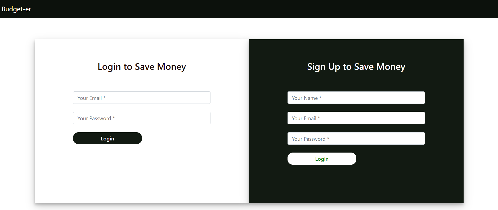
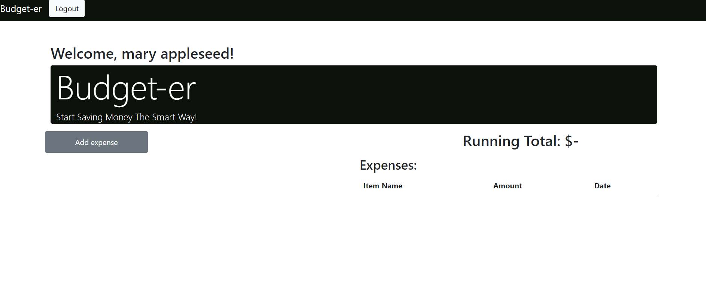
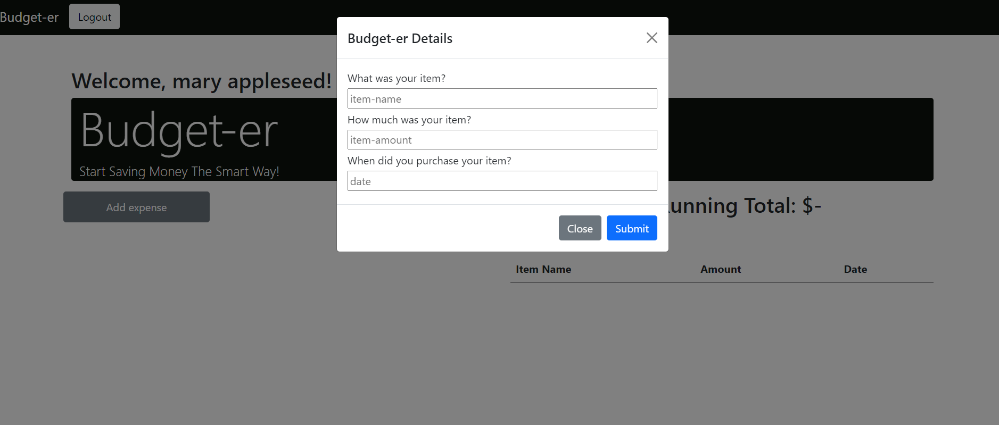

# project-2-bootcamp

## Description
This application helps a user plan their monthly expense better thereby helping them save smartly every month.

## Table of Contents
* [Usage](#Usage)
* [Features](#Features)
* [User Story](#User-Story)
* [Collaborators](#Collaborators)
* [Applications-Used](#Applications-Used)
* [Credits/Citations](#Credits/Citations)
* [Heroku Link](#Heroku-Link)
* [Screenshots](#Screenshots)

## Usage
This full-stack application utilizes technologies such as Node, Express, MySQL, Sequelize, Handlebars and Heroku to create an interactive application for the user. The application accepts inputs from the user such as their email, monthly expenses, paid expenses, and calculates their outstanding expenses for them.

## Features
On the home page, the user is prompted to enter their email address and password and sign-up! The user can select from a choice of monthly expenses such as Rent, Credit Card payments, etc and enter their amount. The user can also select which of these expenses have been paid so the application can tell them their outstanding expenses.

## User-Story
* AS A savings focused user,
* I WANT TO budget my monthly expenses at the beginning of every month,
* So THAT I can have minimum outstanding expenses at the end of the month and greater financial stability overall

## Collaborators
* Franklin Tsung
* Priyam Chirawawala
* For our github process, we did have one person be in charge of the pushes to avoid merge conflicts

## Applications-Used
* MySQL
* Node
* Express
* Markdown
* JavaScript
* Bootstrap
* Handlebars
* Sequelize
* Heroku

## Credits/Citations
* TAs for helping us navigate the small size of our group
* Heroku Documentation
* Handlebars Documentation
* Module Lessons 11-14

## Heroku-Link
* **[Click here for deployed Heroku Link](https://desolate-caverns-01190.herokuapp.com/)**

## Demo
See below demo

